# Wedding Planner
Die Kopfzeile (head) deines HTML-Dokuments enthält grundlegende Metadaten und Verknüpfungen

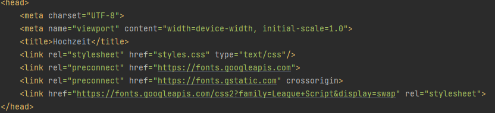

Der Header mit der ID "header" repräsentiert den oberen Abschnitt der Webseite. 
Ein Link in der linken oberen Ecke führt zur Startseite.
Unterhalb befindet sich eine stilvolle Navigationsleiste mit den Abschnitten "Home", "Our Story" (verlinkt zu einer Abschnitts-ID "timeline") 
und "Registry"(verlinkt zu "registry.php"). Diese strukturierte Navigation ermöglicht es den Benutzern, einfach zwischen den Hauptseiten der Webseite zu wechseln.

Der Header-Banner in deinem Hauptabschnitt hat ein Bild im Hintergrund, das beim Scrollen fixiert bleibt. 
Dieser Banner zeigt wichtige Infos zur Hochzeit, wie das Datum und den Veranstaltungsort.

Der "Our Story"-Abschnitt zeigt Beziehungsereignisse in einer Timeline. Jedes Ereignis hat ein Datum, eine kurze Beschreibung und ein Bild. Der Hintergrund ist dunkelgrün, der Titel auffällig, und die Timeline ist horizontal zentriert. Die obere Hälfte zeigt frühere Ereignisse wie das Kennenlernen, die untere Hälfte jüngere Aktivitäten. Das Design ist funktional und visuell ansprechend, mit betonten Bildern und klarem Layout.

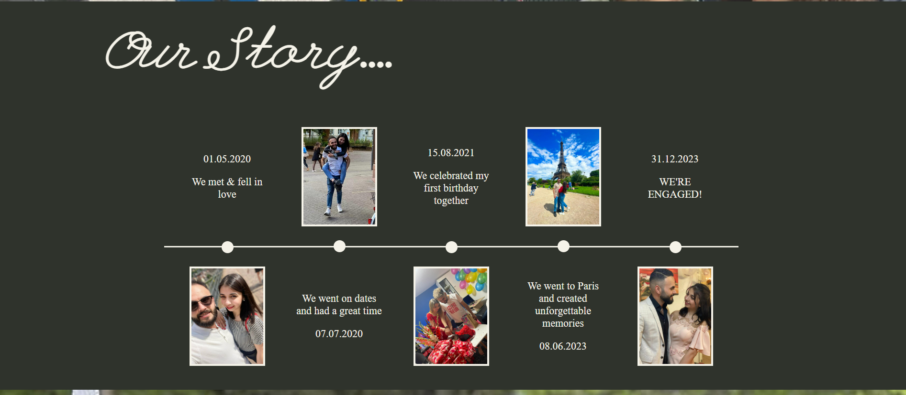

Der "Wedding Day"-Abschnitt in HTML und CSS zeigt die geplanten Hochzeitsveranstaltungen. Die HTML-Struktur ist in Container und innere Divs organisiert. Die Überschrift wird kreativ mit span-Elementen gestaltet. Die Veranstaltungskästen beinhalten Bilder, Datum, Typ und "Details"-Link mit einem Hover-Zoom-Effekt. Die "Details"-Links haben stilvolle Hover-Effekte. Das Design nutzt Hintergrundbilder, Rahmen und Farben für eine ansprechende Darstellung.

Der Footer enthält einen "Back to Top"-Link, der durch ein Pfeil-Symbol repräsentiert wird. Dieser Link ermöglicht es Benutzern, schnell zum Header-Banner zurückzukehren. Der Footer enthält auch eine einfache Information über den Ersteller

Das PHP-Skript aktiviert die Fehlerberichterstattung und stellt eine Verbindung zur MySQL-Datenbank her. Bei Verbindungsfehlern wird eine Fehlermeldung angezeigt. Zudem wird die Zeichenkodierung auf "utf8" eingestellt, um korrekte Datenverarbeitung sicherzustellen.

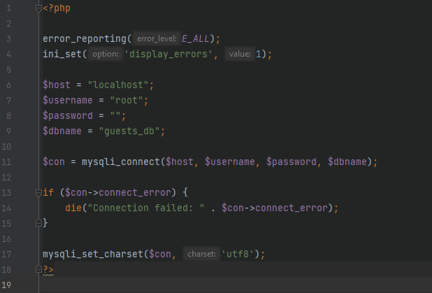

Das PHP-Skript in "registry.php" gestaltet den Header-Bereich der Seite. Es prüft, ob ein Benutzer angemeldet ist, und zeigt entsprechende Informationen oder einen Login-Button an. 
Der Header passt sich dynamisch an die Benutzeranmeldung an und bietet personalisierte Funktionen.

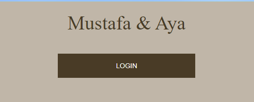

Der JavaScript-Code ermöglicht die Filterung von Einkaufsartikeln nach Kategorien auf einer Webseite. Bei Klick auf entsprechende Icons werden die zugehörigen Produkte angezeigt, während andere ausgeblendet werden. Der PHP-Teil ruft verfügbare Produkte aus der Datenbank ab und erstellt Filtericons

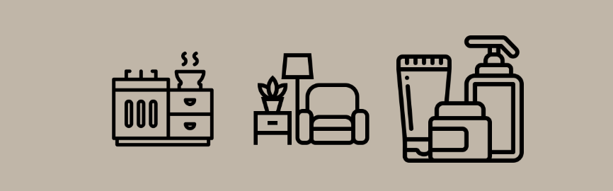

Der PHP-Code durchläuft eine Liste von Produkten aus der Datenbank und erstellt dynamisch HTML-Blöcke für jedes Produkt. Diese Blöcke werden in Reihen angeordnet, wobei maximal drei Produkte pro Reihe angezeigt werden. Der erzeugte HTML-Code enthält Informationen wie Produktbild, Name, Preis und einen "Buy" -Button. Der Code stellt sicher, dass die Reihen korrekt geschlossen werden, um eine ordnungsgemäße 
Anzeige auf der Webseite zu gewährleisten.

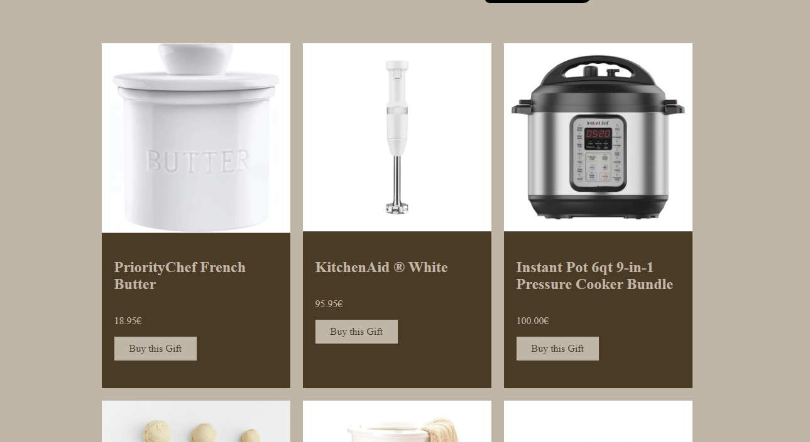
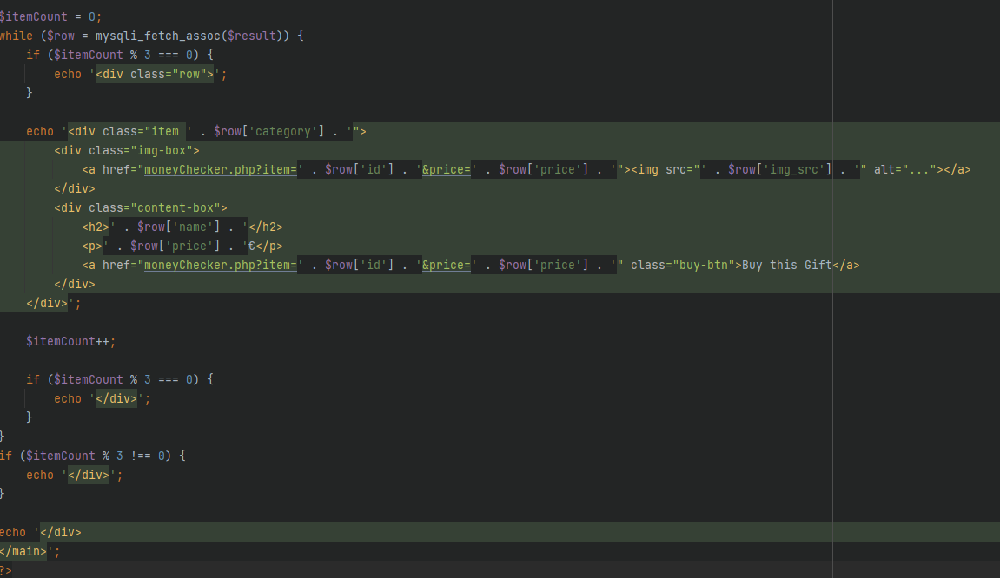

Der PHP-Code handhabt die Registrierung von Gästen für eine Webseite. Bei Absenden des Registrierungsformulars werden die eingegebenen Daten in die Datenbank eingefügt. Falls die Registrierung erfolgreich ist, wird zur Login-Seite weitergeleitet.
Falls bereits eine aktive Benutzersitzung besteht, wird automatisch zur Registry-Seite weitergeleitet  
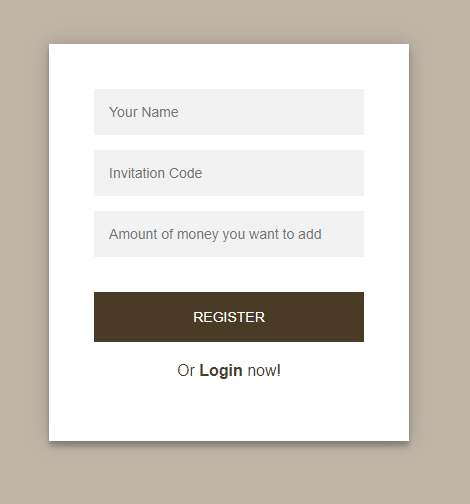
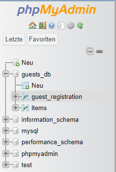  
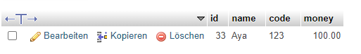

Die PHP-Datei behandelt die Benutzeranmeldung für eine Webseite. Wenn bereits eine Benutzersitzung aktiv ist, wird der Benutzer zur Registry-Seite weitergeleitet. Andernfalls wird ein einfaches Anmeldeformular mit den Feldern "Name", "Einladungscode" und einem Anmeldebutton angezeigt. Es gibt auch einen Link, um sich zu registrieren.
Wenn es Fehler bei der Anmeldung gibt, wird eine entsprechende Fehlermeldung angezeigt.

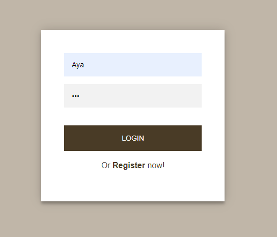  
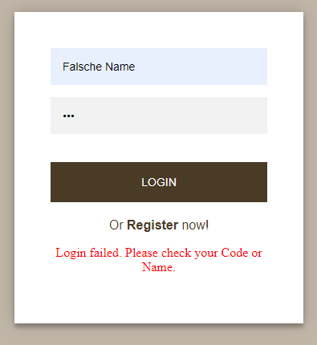  

Im Info-Display des Headers wird, wenn ein Benutzer angemeldet ist, dessen Name und aktueller Kontostand angezeigt. Ein "Logout"-Button ermöglicht das Abmelden. 
Falls kein Benutzer angemeldet ist, wird ein "Login"-Button angezeigt, der zur Anmeldeseite führt.
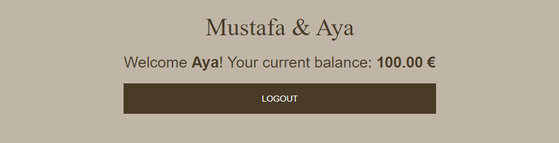  

Wenn der Benutzer ein Produkt kaufen möchte und ausreichend Geld hat, wird der Kauf abgeschlossen, das Guthaben aktualisiert und eine Erfolgsmeldung angezeigt.
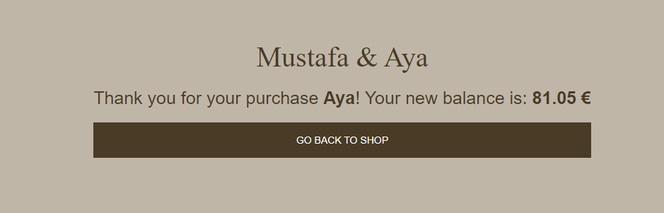 
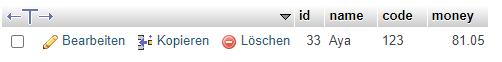 
Wenn nicht genügend Geld vorhanden ist, wird eine Benachrichtigung angezeigt und die Möglichkeit gegeben, Geld hinzuzufügen.
Es gibt auch die Option, zum Shop zurückzukehren. 
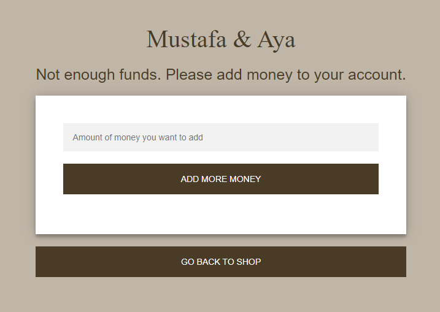 

Wenn kein Benutzer angemeldet ist, wird ein entsprechender Hinweis angezeigt und der Login aufgefordert.

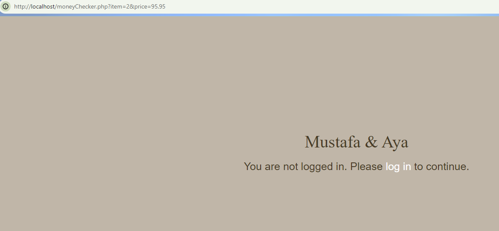 

Wenn ein Benutzer genügend Geld hat, um ein Produkt zu kaufen, wird das is_available-Attribut dieses Produkts auf 0 gesetzt, um es als "nicht verfügbar" zu markieren. 
Dies stellt sicher, dass es nach dem Kauf nicht mehr im Shop angezeigt wird, da die Abfrage für die Produktanzeige normalerweise nur Produkte mit is_available = 1 abruft.

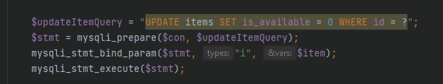 
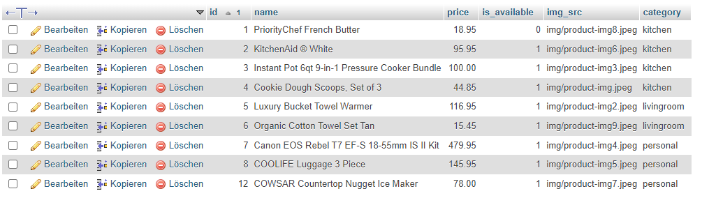 
 
